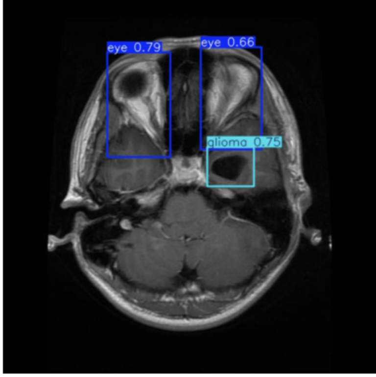
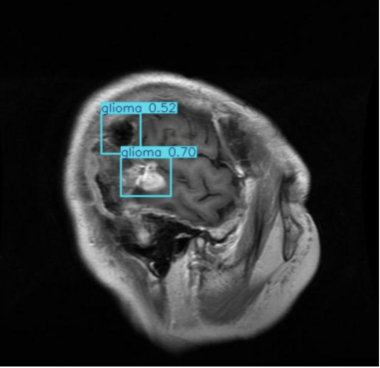
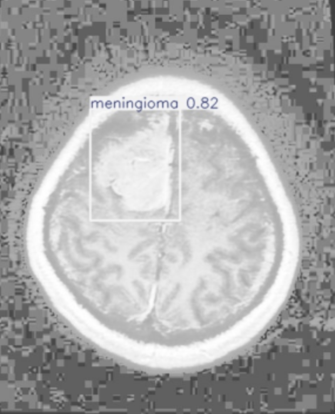
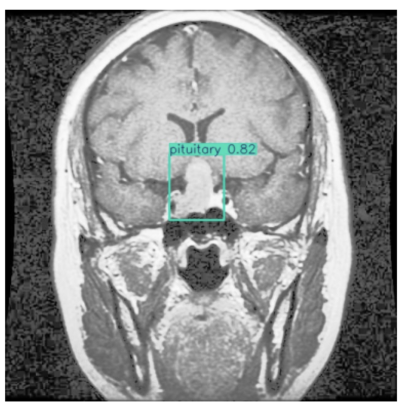

# Brain Tumor Detection Using YOLOv8

Overview

This project implements a deep learning-based computer vision system for detecting and localizing brain tumors from MRI scan images using YOLOv8

The model is trained on annotated MRI images and evaluated using object-detection performance metrics. The project also includes an inference pipeline for testing the trained model on individual MRI images and a Gradio-based interface for demonstrating the detection system.

## Dataset

The project uses an annotated brain MRI dataset prepared for object detection.

The dataset is organized in YOLO format and includes the image data, corresponding annotations, and a `data.yaml` configuration file defining the dataset structure and classes.

The dataset is used for training and validating the YOLOv8 brain tumor detection model.

## Technologies Used

* **Python**
* **YOLOv8**
* **PyTorch**
* **Roboflow**
* **OpenCV**
* **NumPy**
* **Pandas**
* **Matplotlib**
* **Gradio**
* **Google Colab**

## Model & Training

The project uses **YOLOv8n**, a lightweight object detection model, for detecting and localizing brain tumors in MRI scans.

### Training Configuration

* **Model:** YOLOv8n
* **Epochs:** 25
* **Batch Size:** 64
* **Task:** Object Detection
* **Input:** Brain MRI images
* **Output:** Bounding boxes around detected tumor regions

  ## Results & Performance

The trained YOLOv8n model was evaluated on the validation dataset using standard object detection metrics.

| Metric               |     Score |
| -------------------- | --------: |
| Precision            | **79.2%** |
| Recall / Sensitivity | **84.7%** |
| mAP@50               | **84.9%** |
| mAP@50–95            | **54.2%** |

The model achieved a **mAP@50 of 84.9%** and a **recall of 84.7%**, demonstrating its ability to identify and localize tumor regions in MRI images.

### Validation Loss

* Final validation box loss: **1.306**
* Final validation class loss: **0.771**

  ## Demo / Predictions

The trained YOLOv8n model was tested on MRI scan images to detect and localize tumor regions.

### Sample Predictions

## Future Improvements

- Experiment with larger YOLOv8 variants for improved detection performance
- Increase dataset diversity and size
- Explore image augmentation and hyperparameter optimization
- Investigate tumor segmentation for more precise localization
- Improve the deployment interface for practical testing

  ## Conclusion

This project demonstrates the use of YOLOv8 for automated brain tumor detection and localization from MRI scans. The model achieved 84.9% mAP@50 and 84.7% recall on the validation dataset, showing promising performance for computer vision-based medical image analysis.

